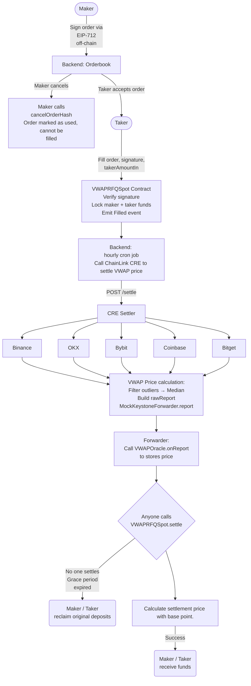

# Souzu VWAP

Programmable VWAP settlement for DeFi, powered by Chainlink CRE.

A settlement-grade spot exchange where large trades settle at the **12-hour VWAP price** computed by a decentralized Chainlink CRE DON across five major exchanges.

> **Big trades shouldn't carry execution risk — trade at the market's consensus price.**

---

## Demo Video

> [Link to demo video](#) _(3–5 min walkthrough of the CRE workflow simulation and live app)_

**Live App:** [souzu.netlify.app](https://souzu.netlify.app)

---

## Why VWAP?

According to _The TRADE Algorithmic Trading Survey_, over **70% of traders** use VWAP as their primary execution algorithm for low-urgency trades — it is the industry standard for large block settlement.

On-chain, large trades face a fundamental problem: any real-time price feed exposes the taker to execution risk. VWAP removes this by settling at the market's volume-weighted consensus price over a 12-hour window, eliminating price impact on the settlement itself.

- **Taker:** When the trade is big, market impact gets expensive — VWAP gives you the market's consensus price.
- **Maker:** When the trade is big, execution matters — beat the market's consensus and keep the edge.

---

## Why CRE?

**VWAP must see the whole market, not just the chain.**
Real volume lives on Binance, Coinbase, and OKX — not on DEXes. On-chain DEX VWAP is not only incomplete, it can be manipulated with a flash loan wash trade at near-zero cost.

**VWAP is not a price an oracle can continuously publish.**
Traditional oracles push a single reference price. VWAP changes with every trade's time window — there is no single "the VWAP" that can be pre-computed and cached. It must be calculated on demand, per settlement.

**Only CRE makes this possible in a decentralized way.**
Each CRE node independently fetches historical candle data from five CEX APIs and computes the VWAP — no shared signer, no central aggregator. OCR consensus ensures no single node can influence the result. Without CRE, VWAP is just one server's word. With CRE, it becomes a price confirmed by the entire network.

---

## How It Works

1. **Maker** signs an EIP-712 order off-chain (amount, min out, delta bps, deadline) and submits it to the orderbook
2. **Taker** calls `fill()` — contract verifies the signature, locks WETH + USDC, records `startTime` / `endTime` (+12h)
3. **Backend** detects the `Filled` event; an **hourly cron job** scans for expired orders and triggers the settler
4. **CRE Workflow** (`chainlink-vwap-contract-cre`) fetches 1h OHLCV candles from five CEXes, computes VWAP, applies circuit breakers, and writes a signed price report on-chain via the Forwarder — same workflow code in both modes (see [MockForwarder vs Production CRE](#mockforwarder-vs-production-cre))
5. **Forwarder** writes the signed report on-chain via `onReport()`
6. **Anyone** calls `settle()` — `VWAPRFQSpot` reads oracle price, applies `deltaBps`, distributes funds to maker and taker
7. If no one settles within the grace period, **anyone** calls `refund()` — both parties reclaim their original deposits

---

## Architecture



---

## Chainlink Integration

### CRE Workflow

| File | Description |
|------|-------------|
| [`chainlink-vwap-contract-cre/vwap-eth-quote-flow/workflow.go`](./chainlink-vwap-contract-cre/vwap-eth-quote-flow/workflow.go) | Main CRE Workflow: fetches multi-exchange OHLCV, computes 12h VWAP, applies circuit breakers, writes on-chain via OCR |
| [`chainlink-vwap-contract-cre/vwap-eth-quote-flow/workflow.yaml`](./chainlink-vwap-contract-cre/vwap-eth-quote-flow/workflow.yaml) | CRE CLI workflow config (targets, trigger settings) |
| [`chainlink-vwap-contract-cre/project.yaml`](./chainlink-vwap-contract-cre/project.yaml) | CRE CLI project settings (RPC, forwarder addresses for Sepolia) |
| [`chainlink-vwap-contract-cre/cmd/server/`](./chainlink-vwap-contract-cre/cmd/server/) | Settler microservice: exposes `POST /settle`, runs `cre workflow simulate`, submits rawReport on-chain |
| [`chainlink-vwap-contract-cre/cmd/trigger/main.go`](./chainlink-vwap-contract-cre/cmd/trigger/main.go) | Production trigger: signs and sends HTTP POST to live CRE DON endpoint |

### Smart Contracts

| File | Description |
|------|-------------|
| [`chainlink-vwap-contract-cre/contracts/evm/src/ChainlinkVWAPAdapter.sol`](./chainlink-vwap-contract-cre/contracts/evm/src/ChainlinkVWAPAdapter.sol) | Production oracle — receives signed VWAP reports from CRE Forwarder via `IReceiver` |
| [`chainlink-vwap-contract-cre/contracts/evm/src/keystone/IReceiver.sol`](./chainlink-vwap-contract-cre/contracts/evm/src/keystone/IReceiver.sol) | Chainlink Keystone `IReceiver` interface |
| [`chainlink-vwap-contract-cre/contracts/evm/src/VWAPRFQSpot.sol`](./chainlink-vwap-contract-cre/contracts/evm/src/VWAPRFQSpot.sol) | Main exchange contract — reads oracle price on `settle()` |
| [`chainlink-vwap-contract-cre/contracts/evm/src/ManualVWAPOracle.sol`](./chainlink-vwap-contract-cre/contracts/evm/src/ManualVWAPOracle.sol) | Staging oracle — implements `IReceiver`, used for simulation and demo |

---

## Deployed Contracts (Sepolia)

| Contract | Address |
|----------|---------|
| ManualVWAPOracle | [`0xd7D42352bB9F84c383318044820FE99DC6D60378`](https://sepolia.etherscan.io/address/0xd7D42352bB9F84c383318044820FE99DC6D60378) |
| VWAPRFQSpot | [`0x61A73573A14898E7031504555c841ea11E7FB07F`](https://sepolia.etherscan.io/address/0x61A73573A14898E7031504555c841ea11E7FB07F) |
| MockKeystoneForwarder (Chainlink) | [`0x15fC6ae953E024d975e77382eEeC56A9101f9F88`](https://sepolia.etherscan.io/address/0x15fC6ae953E024d975e77382eEeC56A9101f9F88) |

---

## Quick Start

```bash
git clone --recurse-submodules https://github.com/pelith/Souzu-VWAP
```

If you already cloned without `--recurse-submodules`, run:

```bash
git submodule update --init --recursive
```

| Component | Setup Guide |
|-----------|-------------|
| CRE Workflow & Contracts | [chainlink-vwap-cre/README.md](./chainlink-vwap-cre/README.md) |
| Backend | [chainlink-vwap-be/README.md](./chainlink-vwap-be/README.md) |
| Frontend | [chainlink-vwap-fe/README.md](./chainlink-vwap-fe/README.md) |

---

## Appendix

### CRE Workflow Simulation

Run a live simulation without a CRE account — fetches real CEX data and computes current VWAP:

```bash
cd chainlink-vwap-contract-cre

# Unit tests
cd vwap-eth-quote-flow && go test -v

# CLI simulation (past 12h, real exchange data)
cre workflow simulate vwap-eth-quote-flow \
  --non-interactive --trigger-index 0 \
  --http-payload '{"startTime":1739552400,"endTime":1739595600}' \
  --target staging-settings
```

### Scripts

| Script | Description |
|--------|-------------|
| [`scripts/simulate.sh`](./chainlink-vwap-contract-cre/scripts/simulate.sh) | Run CRE simulate with a custom payload |
| [`scripts/simulate-and-forward.sh`](./chainlink-vwap-contract-cre/scripts/simulate-and-forward.sh) | Simulate + submit rawReport on-chain via MockKeystoneForwarder |
| [`scripts/demo-vtn.sh`](./chainlink-vwap-contract-cre/scripts/demo-vtn.sh) | Create demo orders on Tenderly VTN in four settlement states |

### MockForwarder vs Production CRE

The CRE workflow code (`workflow.go`) is identical in both modes — only the execution environment differs.

**Current (demo):** Backend hourly cron job triggers the settler microservice (`cmd/server`), which runs `cre workflow simulate` on a single node — fetching real CEX data and computing VWAP the same way — then submits the rawReport to `MockKeystoneForwarder`.

**Production (live CRE DON):** CRE native cron job fires an HTTP Trigger across all DON nodes. Each node independently executes `workflow.go`; OCR consensus selects the median → signed report submitted via the real CRE Forwarder with F+1 signature verification.

| | Demo (current) | Production |
|-|---------------|------------|
| Workflow trigger | Backend hourly cron → `cmd/server` | CRE native cron + HTTP Trigger |
| Execution | Single-node `cre workflow simulate` | All DON nodes independently |
| Consensus | None (single result) | OCR — F+1 DON signatures |
| Oracle contract | `ManualVWAPOracle` | `ChainlinkVWAPAdapter` |
| Forwarder | `MockKeystoneForwarder` | CRE Forwarder |
